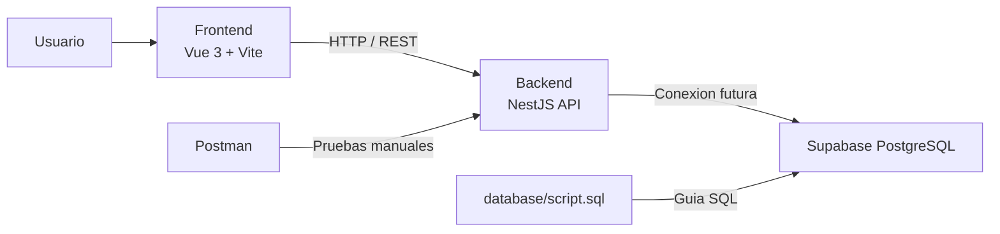

# Easy Bike

Easy Bike es un proyecto web full stack en etapa de bootstrap. La idea del sistema es servir como base para una plataforma relacionada con bicicletas, mientras el equipo construye sus modulos de negocio sobre una arquitectura separada de frontend, backend, base de datos y pruebas.

En el estado actual, el proyecto ya incluye:

- `frontend/` con Vue 3 + Vite + TypeScript.
- `backend/` con NestJS + TypeScript.
- `database/` con una plantilla SQL neutra para Supabase/PostgreSQL.
- `postman/` con una coleccion inicial para probar la API.
- `docs/` para manuales, capturas y entregables.

## Que hace hoy el sitio

Hoy el sistema funciona como una base de arranque del equipo:

- El frontend muestra la aplicacion cliente creada con Vue.
- El backend expone un endpoint raiz y endpoints de salud.
- La carpeta `database/` deja preparado el lugar donde el encargado de BD definira el esquema real.
- La coleccion de Postman permite probar que la API responde.

En otras palabras: el repositorio todavia no implementa los modulos finales del negocio, pero ya deja montada la estructura para que el equipo trabaje en paralelo.

## Stack tecnico

- Frontend: Vue 3, Vite, TypeScript
- Backend: NestJS, Node.js, TypeScript
- Base de datos objetivo: Supabase PostgreSQL
- Pruebas manuales: Postman
- Control de versiones: Git + GitHub

## Estructura del proyecto

```text
easy-bike/
├── backend/      # API REST con NestJS
├── frontend/     # Aplicacion web con Vue
├── database/     # Script SQL y soporte para BD
├── postman/      # Coleccion para probar endpoints
├── docs/         # Documentacion, capturas y manuales
├── README.md
└── .gitignore
```

## Arquitectura



## Requisitos previos

- Node.js 22 o superior
- npm 10 o superior
- Git
- Cuenta de Supabase para la configuracion futura de base de datos

## Variables de entorno

### Backend

Crear `backend/.env` con:

```env
PORT=3000
FRONTEND_URL=http://localhost:5173
DATABASE_URL=
```

Notas:

- `FRONTEND_URL` se usa para CORS.
- `DATABASE_URL` quedara a cargo del responsable de base de datos cuando se conecte Supabase.

### Frontend

Cuando el frontend necesite consumir la API, puede crear `frontend/.env` con:

```env
VITE_API_URL=http://localhost:3000
```

## Instalacion

### Backend

```bash
cd backend
npm install
npm run start:dev
```

La API quedara disponible en `http://localhost:3000`.

### Frontend

```bash
cd frontend
npm install
npm run dev
```

La aplicacion quedara disponible en `http://localhost:5173`.

## Endpoints disponibles

- `GET /`
  Devuelve informacion base del backend.
- `GET /health`
  Devuelve el estado general del servicio.
- `GET /health/db`
  Indica si la variable `DATABASE_URL` ya fue configurada para la futura conexion con Supabase.

## Archivos de apoyo

- `database/script.sql`
  Plantilla SQL neutra para que el encargado de base de datos defina el esquema real.
- `postman/easy-bike.postman_collection.json`
  Coleccion base para probar el backend desde Postman.

## Estado actual

Lo que ya esta listo:

- estructura del monorepo academico
- frontend creado con Vue
- backend creado con NestJS
- endpoints de salud del backend
- soporte base para entorno y CORS
- archivos iniciales para SQL y Postman

Lo que falta completar con el equipo:

- interfaz real del producto
- modulos de negocio del backend
- conexion real con Supabase
- modelo de base de datos
- documentacion funcional y manuales

## Flujo recomendado para el equipo

- `main`: rama estable
- `develop`: integracion del equipo
- `feature/nombre-modulo`: trabajo individual por funcionalidad

## Buenas practicas ya aplicadas

- `.env` y carpetas de build quedan fuera del repositorio
- la configuracion del backend usa variables de entorno
- el script SQL no impone un modelo antes de que el DBA lo defina
- la API expone endpoints de verificacion desde el inicio
